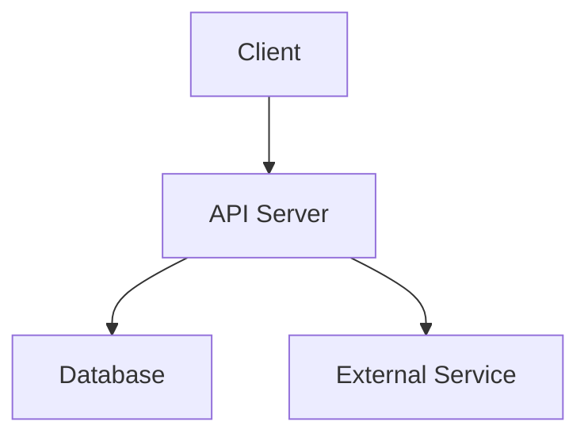

# DESIGN.md -- Greenlight Brownfield Support + Roadmap & Documentation

> **Project:** Greenlight
> **Scope:** Add brownfield support (`/gl:assess`, `/gl:wrap`) and human-facing documentation system (`/gl:roadmap`, `/gl:changelog`, auto-summaries, decision log, living architecture diagram). Update existing commands for brownfield awareness and documentation integration.
> **Stack:** Go 1.24, stdlib only. But the deliverables are markdown prompt files, not Go code.
> **Date:** 2026-02-09
> **Replaces:** Previous DESIGN.md (CLI stabilisation -- complete, 228 tests passing)

---

## 1. Requirements

### 1.1 Functional Requirements -- /gl:assess

#### FR-1: Prerequisites and Context Loading

| ID | Requirement |
|----|-------------|
| FR-1.1 | MUST read `.greenlight/codebase/` docs produced by `/gl:map` as primary input |
| FR-1.2 | MUST read `.greenlight/config.json` for project context (stack, test commands, project directories) |
| FR-1.3 | MUST work without `/gl:map` having been run; warn that results will be shallow and recommend running `/gl:map` first |
| FR-1.4 | MUST NOT require any other command to have been run first (assess is always available) |
| FR-1.5 | MUST read `CLAUDE.md` engineering standards for gap comparison baseline |

#### FR-2: Test Coverage Analysis

| ID | Requirement |
|----|-------------|
| FR-2.1 | MUST map source files to corresponding test files using stack-specific naming conventions |
| FR-2.2 | MUST detect test file patterns per stack: Go (`*_test.go` co-located), Python (`test_*.py` / `*_test.py` in `tests/` or co-located), JS/TS (`*.test.{js,ts}` / `*.spec.{js,ts}` in `__tests__/` or co-located), Rust (`#[cfg(test)]` inline + `tests/` dir) |
| FR-2.3 | MUST calculate source-to-test file ratio (e.g., "47 source files, 12 test files, 25% coverage by file count") |
| FR-2.4 | MUST flag source files with zero test coverage (no corresponding test file found) |
| FR-2.5 | IF `test.coverage_command` is configured in `config.json`, MUST run it and parse output for line/branch coverage percentages |
| FR-2.6 | IF `test.coverage_command` is NOT configured, MUST note in output that coverage percentages are unavailable; file mapping still runs |
| FR-2.7 | MUST classify each source directory/module as: tested (>50% files have tests), partially tested (1-50%), untested (0%) |

#### FR-3: Contract Inventory

| ID | Requirement |
|----|-------------|
| FR-3.1 | MUST scan for typed schemas, interfaces, validation logic, and API route definitions |
| FR-3.2 | MUST classify each boundary as: **explicit** (typed interface/schema/contract exists), **implicit** (behaviour exists but no formal type definition), **none** (untyped, unvalidated boundary) |
| FR-3.3 | MUST identify external boundaries: API endpoints, database queries, third-party service calls, webhook handlers, message consumers |
| FR-3.4 | MUST identify internal module boundaries: exported functions, public interfaces, cross-package imports |
| FR-3.5 | MUST record the source file and line range for each identified boundary |

#### FR-4: Risk Assessment

| ID | Requirement |
|----|-------------|
| FR-4.1 | MUST spawn `gl-security` agent in `full-audit` mode for security scanning |
| FR-4.2 | MUST identify fragile areas: high cyclomatic complexity, deep nesting (>4 levels), long functions (>50 lines), high fan-in/fan-out |
| FR-4.3 | MUST identify critical paths: authentication flows, authorization checks, payment processing, data mutation endpoints, admin operations |
| FR-4.4 | MUST assess tech debt hotspots: `TODO`/`FIXME`/`HACK` comments with file locations, deprecated API usage, outdated dependency patterns |
| FR-4.5 | SHOULD check dependency health: outdated versions, known vulnerabilities (via `npm audit` / `pip audit` / `go vet` / `cargo audit` as appropriate) |
| FR-4.6 | Security findings from gl-security MUST be included in ASSESS.md under a dedicated section |

#### FR-5: Architecture Gap Analysis

| ID | Requirement |
|----|-------------|
| FR-5.1 | MUST compare existing codebase against CLAUDE.md engineering standards (error handling, naming, functions, security, API design, database, testing, logging, file structure, git, performance) |
| FR-5.2 | MUST identify specific standard violations with file paths and line numbers where possible |
| FR-5.3 | MUST categorize gaps by severity: CRITICAL (security/correctness risk), HIGH (maintainability risk), MEDIUM (quality concern), LOW (style/convention) |
| FR-5.4 | MUST produce a standards compliance summary table showing pass/fail per CLAUDE.md section |

#### FR-6: Output (ASSESS.md)

| ID | Requirement |
|----|-------------|
| FR-6.1 | MUST produce `.greenlight/ASSESS.md` as structured output following the schema in section 4.1 |
| FR-6.2 | MUST include a prioritized wrap recommendation as a priority-tiered list: Critical, High, Medium tiers |
| FR-6.3 | Each recommended boundary MUST include: name, type (external/internal), current contract status (explicit/implicit/none), test status, estimated complexity, risk level |
| FR-6.4 | MUST commit ASSESS.md with conventional commit: `docs: greenlight codebase assessment` |
| FR-6.5 | MUST report summary to user after completion: boundary count, coverage stats, critical findings count, recommended next action |

### 1.2 Functional Requirements -- /gl:wrap

#### FR-7: Prerequisites

| ID | Requirement |
|----|-------------|
| FR-7.1 | MUST read `.greenlight/ASSESS.md` if it exists; use it as primary input for prioritization |
| FR-7.2 | MUST work without ASSESS.md; user can choose what to wrap manually |
| FR-7.3 | MUST read `.greenlight/config.json` for test commands and project context |
| FR-7.4 | MUST read `.greenlight/codebase/` docs for codebase understanding |
| FR-7.5 | MUST read existing `.greenlight/CONTRACTS.md` if it exists; do not duplicate existing contracts |
| FR-7.6 | MUST read `CLAUDE.md` engineering standards |

#### FR-8: Prioritize What to Wrap

| ID | Requirement |
|----|-------------|
| FR-8.1 | IF ASSESS.md exists, MUST present the priority-tiered wrap recommendation from the assessment |
| FR-8.2 | IF ASSESS.md does not exist, MUST scan the codebase for boundaries and present them to the user |
| FR-8.3 | MUST let the user pick which boundary/module to wrap |
| FR-8.4 | MUST show estimated complexity for each candidate: file count, function count, dependency count |
| FR-8.5 | MUST prevent wrapping the entire codebase at once; enforce one boundary per wrap invocation |
| FR-8.6 | Wrapper agent MUST assess whether the selected boundary fits within 50% context budget; if too large, suggest splitting into sub-boundaries and present them for selection |

#### FR-9: Extract Contracts

| ID | Requirement |
|----|-------------|
| FR-9.1 | MUST analyse existing implementation code to infer implicit contracts |
| FR-9.2 | MUST identify: function signatures, parameter types, return types, error types/patterns, validation rules, invariants observable from code |
| FR-9.3 | MUST present extracted contracts to the user for review and confirmation before writing |
| FR-9.4 | MUST write approved contracts to `.greenlight/CONTRACTS.md` with `[WRAPPED]` tag |
| FR-9.5 | Contracts MUST be descriptive (what code DOES), not prescriptive (what it SHOULD do) |
| FR-9.6 | `[WRAPPED]` tag MUST include: `Source: {file}:{lines}`, `Wrapped on: {date}`, `Locking tests: tests/locking/{boundary}.test.{ext}` |
| FR-9.7 | MUST follow existing contract format from `gl-architect.md`: input, output, errors, invariants, security, dependencies |

#### FR-10: Write Locking Tests

| ID | Requirement |
|----|-------------|
| FR-10.1 | MUST generate tests that verify existing behaviour (locking tests, not specification tests) |
| FR-10.2 | Locking tests MUST pass against existing code without any source code changes |
| FR-10.3 | Locking tests MUST go in `tests/locking/{boundary-name}.test.{ext}` -- one file per boundary |
| FR-10.4 | MUST test both happy paths and observable error paths of existing code |
| FR-10.5 | MUST NOT test implementation details; test observable behaviour at the boundary (inputs/outputs) |
| FR-10.6 | MUST handle non-deterministic behaviour automatically: timestamps (freeze time), random IDs (use matchers), environment-dependent values (mock env) |
| FR-10.7 | IF a locking test cannot be made to pass after 2 attempts due to non-determinism or complexity, document the specific assertion in ASSESS.md as non-deterministic and skip it |
| FR-10.8 | Test names MUST use descriptive `[LOCK]` prefix: `[LOCK] should return user object when valid email provided` |

#### FR-11: Run and Verify

| ID | Requirement |
|----|-------------|
| FR-11.1 | MUST run locking tests after generation using `config.test.command` |
| FR-11.2 | ALL locking tests MUST pass; if they don't, the tests are wrong (not the code) |
| FR-11.3 | IF any locking test fails, the wrapper MUST fix the test (not the code) and re-run |
| FR-11.4 | Maximum 3 test-fix-rerun cycles per boundary before escalating to user |
| FR-11.5 | MUST report test results: total tests, passing, any skipped due to non-determinism |
| FR-11.6 | MUST run full test suite after locking tests pass to ensure no regressions |

#### FR-12: Security Baseline

| ID | Requirement |
|----|-------------|
| FR-12.1 | MUST spawn `gl-security` agent in `slice` mode scoped to the wrapped boundary's files |
| FR-12.2 | Security issues MUST be documented in ASSESS.md (or created if it doesn't exist), NOT fixed during wrap |
| FR-12.3 | Security findings MUST be recorded as known issues in the Wrapped Boundaries table of STATE.md |
| FR-12.4 | Security agent MUST NOT write failing tests during wrap (unlike in /gl:slice); document only |

#### FR-13: Commit and Track

| ID | Requirement |
|----|-------------|
| FR-13.1 | MUST commit locking tests and extracted contracts atomically |
| FR-13.2 | Commit MUST use conventional format: `test(wrap): lock {boundary-name}` |
| FR-13.3 | Commit body MUST list: contracts extracted (count), locking tests written (count), known security issues (count) |
| FR-13.4 | MUST update `.greenlight/STATE.md` Wrapped Boundaries section with the new boundary |
| FR-13.5 | MUST update `.greenlight/CONTRACTS.md` with wrapped contracts |

#### FR-14: Wrap Summary and Next Action

| ID | Requirement |
|----|-------------|
| FR-14.1 | MUST guide user to either wrap another boundary or start building new features via `/gl:slice` |
| FR-14.2 | MUST show wrap progress: `{N} of {M} boundaries wrapped` (where M comes from ASSESS.md priority list, or is omitted if no ASSESS.md) |
| FR-14.3 | IF all Critical-tier boundaries are wrapped, MUST suggest moving to `/gl:design` or `/gl:slice` for new features |
| FR-14.4 | MUST generate a wrap summary in `.greenlight/summaries/{boundary-name}-wrap-SUMMARY.md` (see FR-26) |
| FR-14.5 | MUST update ROADMAP.md wrap progress if ROADMAP.md exists |

### 1.3 Functional Requirements -- Updates to Existing Commands

#### FR-15: /gl:slice Updates (wraps field, locking-to-integration transition)

| ID | Requirement |
|----|-------------|
| FR-15.1 | GRAPH.json slices MAY include a `wraps` field referencing wrapped boundary names |
| FR-15.2 | When a slice has a `wraps` field, /gl:slice MUST read the existing locking tests for that boundary |
| FR-15.3 | Test writer MUST receive locking test names (not code) as context: "these are the existing locked behaviours" |
| FR-15.4 | After new integration tests pass and verification succeeds, locking tests for the wrapped boundary MUST be deleted |
| FR-15.5 | After locking tests are deleted, the `[WRAPPED]` tag MUST be removed from corresponding contracts in CONTRACTS.md |
| FR-15.6 | STATE.md Wrapped Boundaries status MUST update to `refactored` when locking tests are replaced |
| FR-15.7 | After slice verification succeeds, MUST spawn a Task to generate a slice summary in `.greenlight/summaries/{slice-id}-SUMMARY.md` (see FR-25) |
| FR-15.8 | After summary generation, MUST update ROADMAP.md: slice status, completion date, test count, decisions made during slice |
| FR-15.9 | After summary generation, MUST append any implementation decisions to `.greenlight/DECISIONS.md` (see FR-28) |
| FR-15.10 | After slice completes, MUST check if architecture changed (new service, integration, database table, endpoint group) and update the Architecture Diagram section in ROADMAP.md if so |

#### FR-16: /gl:status Updates

| ID | Requirement |
|----|-------------|
| FR-16.1 | MUST display Wrapped Boundaries table if any wrapped boundaries exist in STATE.md |
| FR-16.2 | Table columns: Boundary, Contracts, Locking Tests (count), Known Issues (count), Status |
| FR-16.3 | Status values for wrapped boundaries: `wrapped` (locking tests in place), `refactored` (replaced by integration tests) |
| FR-16.4 | MUST display a reference to `/gl:roadmap` for human-readable product view if ROADMAP.md exists |

#### FR-17: /gl:help Updates

| ID | Requirement |
|----|-------------|
| FR-17.1 | MUST add BROWNFIELD section between SETUP and BUILD sections |
| FR-17.2 | Commands listed in BROWNFIELD: `/gl:assess` (Gap analysis and risk assessment), `/gl:wrap` (Extract contracts + locking tests) |
| FR-17.3 | MUST add INSIGHT section between MONITOR and SHIP sections |
| FR-17.4 | Commands listed in INSIGHT: `/gl:roadmap` (Product roadmap and milestones), `/gl:changelog` (Human-readable changelog) |
| FR-17.5 | FLOW line MUST update to: `map? -> assess? -> init -> design (ROADMAP.md, DECISIONS.md) -> wrap? -> slice 1 (summary) -> ... -> ship -> roadmap milestone -> ...` |

#### FR-18: /gl:settings Updates

| ID | Requirement |
|----|-------------|
| FR-18.1 | MUST display `assessor` and `wrapper` agent models in settings table |
| FR-18.2 | Valid agents list MUST include `assessor` and `wrapper` |

#### FR-19: /gl:design Updates (brownfield awareness + roadmap/decisions output)

| ID | Requirement |
|----|-------------|
| FR-19.1 | IF `.greenlight/ASSESS.md` exists, designer MUST receive assessment context |
| FR-19.2 | Designer MUST be aware of wrapped boundaries and their contracts when planning new features |
| FR-19.3 | Designer SHOULD suggest which wrapped boundaries to refactor as part of new feature slices |
| FR-19.4 | After design approval, MUST produce `.greenlight/ROADMAP.md` with initial milestone, slices, and architecture diagram (see FR-23) |
| FR-19.5 | After design approval, MUST produce `.greenlight/DECISIONS.md` with all major design decisions (see FR-28) |
| FR-19.6 | When invoked via `/gl:roadmap milestone`, MUST run a scoped design session: receive existing ROADMAP.md + DESIGN.md as context, skip init interview and stack decisions, produce new slices scoped to the milestone, append to GRAPH.json and ROADMAP.md |

#### FR-20: CLAUDE.md Updates

| ID | Requirement |
|----|-------------|
| FR-20.1 | Agent Isolation Rules table MUST add `gl-assessor` row: Can See (codebase docs, test results, standards), Cannot See (N/A -- read-only analytical agent), Cannot Do (modify any code) |
| FR-20.2 | Agent Isolation Rules table MUST add `gl-wrapper` row: Can See (implementation code, existing tests), Cannot See (N/A), Cannot Do (modify production code -- only writes contracts and locking tests) |
| FR-20.3 | MUST add a clearly marked exception note under Agent Isolation Rules: "gl-wrapper is a deliberate exception. It sees implementation code AND writes locking tests. This is necessary because locking tests must verify what code currently does, not what contracts say it should do. This exception is scoped: only applies to tests in `tests/locking/`. When a boundary is later refactored via /gl:slice, locking tests are deleted and proper integration tests are written under strict isolation." |

#### FR-21: gl-architect.md Updates

| ID | Requirement |
|----|-------------|
| FR-21.1 | MUST recognise `[WRAPPED]` contracts in CONTRACTS.md |
| FR-21.2 | MUST NOT redefine wrapped contracts; treat them as existing boundaries |
| FR-21.3 | When adding new slices, MUST be able to reference wrapped contracts as dependencies |
| FR-21.4 | When a slice's `wraps` field targets a wrapped boundary, architect MUST plan the contract transition: wrapped contract becomes a proper contract (tag removed) |

#### FR-22: gl-test-writer.md Updates

| ID | Requirement |
|----|-------------|
| FR-22.1 | MUST check for existing locking tests when writing tests for a slice that wraps a boundary |
| FR-22.2 | MUST receive locking test NAMES (not source code) as context for understanding existing locked behaviour |
| FR-22.3 | Integration tests MUST cover at least all behaviours that locking tests covered (superset) |
| FR-22.4 | MUST NOT be aware of locking test implementation -- only names/descriptions |

### 1.4 Functional Requirements -- /gl:roadmap

#### FR-23: Roadmap Creation and Structure

| ID | Requirement |
|----|-------------|
| FR-23.1 | MUST produce `.greenlight/ROADMAP.md` as a living document during first `/gl:design` session |
| FR-23.2 | ROADMAP.md MUST contain: project overview, current milestone with slice table, architecture diagram, key decisions summary |
| FR-23.3 | Each milestone in ROADMAP.md MUST have: name, goal (one sentence), status (planning/active/complete/archived), slice table |
| FR-23.4 | Milestone slice table columns: Slice, Description, Status, Tests, Completed, Key Decision |
| FR-23.5 | ROADMAP.md MUST be updated automatically as slices complete (by /gl:slice orchestrator) |
| FR-23.6 | ROADMAP.md MUST include a wrap progress section if any wrapped boundaries exist |

#### FR-24: Roadmap Sub-Commands

| ID | Requirement |
|----|-------------|
| FR-24.1 | `/gl:roadmap` (no arguments) MUST display the current ROADMAP.md contents to the user |
| FR-24.2 | `/gl:roadmap milestone` MUST spawn gl-designer with milestone scope to plan a new milestone |
| FR-24.3 | Milestone design session MUST receive existing ROADMAP.md and DESIGN.md as context |
| FR-24.4 | Milestone design session MUST NOT re-run init interview or revisit stack decisions |
| FR-24.5 | Milestone design session MUST produce: new slices appended to GRAPH.json with `milestone` field, new milestone section appended to ROADMAP.md, new decisions appended to DECISIONS.md |
| FR-24.6 | `/gl:roadmap archive` MUST move a completed milestone from the active section to an archived section in ROADMAP.md |
| FR-24.7 | Archived milestones MUST be compressed: milestone name, completion date, slice count, test count, one-line summary |
| FR-24.8 | MUST read `.greenlight/config.json` for project context |

#### FR-25: Auto-Generated Slice Summaries

| ID | Requirement |
|----|-------------|
| FR-25.1 | After every `/gl:slice` completes successfully (verification passes), MUST generate a summary file at `.greenlight/summaries/{slice-id}-SUMMARY.md` |
| FR-25.2 | Summary MUST be generated by spawning a Task (not a separate agent) with fresh context |
| FR-25.3 | Task receives structured data: slice ID, slice name, contracts satisfied (names), test count and results, key files changed (from git diff --stat), deviation log entries (if any), security results summary |
| FR-25.4 | Summary MUST be written in product language (what was built for users), not implementation language |
| FR-25.5 | Summary MUST NOT be optional -- every completed slice gets a summary |
| FR-25.6 | Summary MUST NOT be over-templated -- the Task writes a natural-language summary informed by structured data |
| FR-25.7 | After summary is written, orchestrator MUST update ROADMAP.md: mark slice as complete, add completion date, test count, and any key decisions |

#### FR-26: Wrap Summaries

| ID | Requirement |
|----|-------------|
| FR-26.1 | After every `/gl:wrap` completes successfully, MUST generate a summary file at `.greenlight/summaries/{boundary-name}-wrap-SUMMARY.md` |
| FR-26.2 | Wrap summary MUST be generated by spawning a Task with structured data: boundary name, contracts extracted (count and names), locking tests written (count), known security issues (count and severities), files covered |
| FR-26.3 | Wrap summary MUST describe what was locked in product language (e.g., "Locked the authentication boundary: login, token validation, and session management are now protected by 12 locking tests") |
| FR-26.4 | Wrap summary appears in `/gl:changelog` output alongside slice summaries |

#### FR-27: /gl:quick Updates (summaries and decisions)

| ID | Requirement |
|----|-------------|
| FR-27.1 | After `/gl:quick` completes, MUST generate a summary file at `.greenlight/summaries/quick-{timestamp}-SUMMARY.md` |
| FR-27.2 | Quick summaries MUST follow the same format as slice summaries but are more concise |
| FR-27.3 | IF the quick task involved a decision, MUST append to DECISIONS.md |
| FR-27.4 | MUST update ROADMAP.md if the quick task is associated with a milestone (via user confirmation) |

#### FR-28: Decision Log

| ID | Requirement |
|----|-------------|
| FR-28.1 | MUST maintain `.greenlight/DECISIONS.md` as a single-file decision log |
| FR-28.2 | Decision log table columns: #, Decision, Context, Chosen, Rejected, Date, Source |
| FR-28.3 | Source column values: `design` (from /gl:design), `milestone` (from /gl:roadmap milestone), `slice:{id}` (from /gl:slice), `quick` (from /gl:quick), `wrap:{boundary}` (from /gl:wrap) |
| FR-28.4 | `/gl:design` MUST write initial decisions to DECISIONS.md (major architectural and technical decisions from the design session) |
| FR-28.5 | During `/gl:slice`, each agent MUST note decisions in its output; the orchestrator aggregates and appends to DECISIONS.md after the slice completes |
| FR-28.6 | Decision numbering MUST be sequential across the entire file (D-1, D-2, D-3...) regardless of source |
| FR-28.7 | DECISIONS.md MUST NOT duplicate the technical decisions table in DESIGN.md; DESIGN.md decisions are the initial entries, DECISIONS.md is the running log that starts from those and continues |

#### FR-29: Living Architecture Diagram

| ID | Requirement |
|----|-------------|
| FR-29.1 | ROADMAP.md MUST include an Architecture Diagram section with a text-based diagram (Mermaid or ASCII) |
| FR-29.2 | Initial architecture diagram MUST be produced during `/gl:design` as part of ROADMAP.md creation |
| FR-29.3 | After each `/gl:slice` completes, the summary Task MUST check if the architecture changed: new service added, new external integration, new database table, new endpoint group |
| FR-29.4 | IF architecture changed, the Task MUST update the Architecture Diagram section in ROADMAP.md |
| FR-29.5 | IF architecture did NOT change, the diagram MUST NOT be modified |
| FR-29.6 | Diagram MUST remain text-based in markdown (no images, no external tools) |

#### FR-30: /gl:changelog Command

| ID | Requirement |
|----|-------------|
| FR-30.1 | `/gl:changelog` (no arguments) MUST display a full human-readable changelog from all summaries in `.greenlight/summaries/` |
| FR-30.2 | `/gl:changelog milestone {N}` MUST display changelog scoped to a specific milestone (filter by slice milestone field) |
| FR-30.3 | `/gl:changelog since {DATE}` MUST display changelog for entries after the given date |
| FR-30.4 | Changelog MUST be formatted chronologically (newest first) |
| FR-30.5 | Each changelog entry MUST include: date, slice/wrap name, one-line summary, test count |
| FR-30.6 | Changelog is read-only -- it reads from summaries/ and formats, it does not write any files |
| FR-30.7 | MUST read `.greenlight/config.json` for project context |

### 1.5 Non-Functional Requirements

| ID | Category | Requirement |
|----|----------|-------------|
| NFR-1 | Context budget | gl-assessor MUST complete within 50% context window. If codebase is too large, split analysis by directory/module and aggregate |
| NFR-2 | Context budget | gl-wrapper MUST complete one boundary wrap within 50% context window. If a boundary is too large, it MUST suggest splitting before proceeding |
| NFR-3 | Idempotency | Running `/gl:assess` multiple times MUST overwrite ASSESS.md (latest assessment replaces previous) |
| NFR-4 | Idempotency | Running `/gl:wrap` on an already-wrapped boundary MUST warn and ask before overwriting existing locking tests |
| NFR-5 | Safety | `/gl:wrap` MUST NEVER modify production source code. It writes contracts and locking tests only |
| NFR-6 | Safety | `/gl:assess` is entirely read-only except for writing ASSESS.md |
| NFR-7 | Compatibility | All commands MUST work with any stack Greenlight supports (Go, Python, JS/TS, Rust, Swift) |
| NFR-8 | Fault tolerance | If gl-security agent fails during assess/wrap, the command MUST continue without security findings (warn user, note in output) |
| NFR-9 | Context budget | Summary generation Task MUST complete within a single Task invocation. Structured data is passed in, not discovered. This keeps context usage minimal |
| NFR-10 | Idempotency | Running `/gl:roadmap` (display) is read-only. Running `/gl:roadmap milestone` appends -- it does not overwrite existing milestones |
| NFR-11 | Idempotency | DECISIONS.md is append-only. Entries are never modified or deleted after creation |
| NFR-12 | Fault tolerance | If summary generation Task fails, the slice/wrap MUST still be considered complete. Summary failure MUST NOT block the TDD pipeline. Warn user and suggest running `/gl:changelog` to check for gaps |

### 1.6 Constraints

| Constraint | Detail |
|------------|--------|
| Deliverables | Markdown prompt files in `src/agents/` and `src/commands/gl/`. NOT Go code |
| Embedding | New `.md` files must be added to Go manifest and `go:embed` directive |
| Agent models | gl-assessor defaults to sonnet (analytical, not decision-making). gl-wrapper defaults to sonnet (follows extracted contracts) |
| Existing flow | New commands MUST NOT break existing greenfield flow. `/gl:assess`, `/gl:wrap`, `/gl:roadmap`, and `/gl:changelog` are optional |
| Commit format | All commits use conventional format enforced by lefthook/commitlint |
| No separate agent for summaries | Summary generation uses a Task spawned by the orchestrator, not a dedicated agent definition. This keeps the agent count manageable |
| Summaries are mandatory | Every completed slice and wrap produces a summary. This is not configurable |

### 1.7 Out of Scope

| Item | Rationale |
|------|-----------|
| Auto-refactoring during wrap | Wrap locks existing behaviour. Refactoring happens in subsequent slices |
| Whole-codebase contract generation | One boundary at a time. Prevents context overflow and ensures quality |
| Failing wrap on poor code quality | Wrap works with any code. That is the point |
| Making /gl:assess mandatory | Assessment is recommended, not required. Users can wrap manually |
| Migration from GSD's `.planning/` folder | Different system, different data model. Not compatible |
| AST parsing or static analysis tooling | Claude reads code natively. No external tooling needed |
| Automated dependency updates | Assess identifies outdated deps. Fixing them is a separate task |
| Test generation for untested code that is NOT being wrapped | Wrap is opt-in per boundary. Assess identifies gaps; wrap addresses them one at a time |
| Separate docs site generator | Summaries and changelog are markdown files in .greenlight/. No static site generation |
| Time/cost tracking per slice | Greenlight tracks what was built and decided, not how long it took |
| Approval gates for roadmap changes | Roadmap updates happen automatically. No review workflow |
| Optional summaries | Summaries are always generated. No configuration to skip them |
| Over-templated summaries | The Task writes natural language, not fill-in-the-blanks. Structured data informs, not constrains |

---

## 2. Technical Decisions

| # | Decision | Chosen | Rejected | Rationale |
|---|----------|--------|----------|-----------|
| TD-1 | Where extracted contracts go | **CONTRACTS.md with `[WRAPPED]` tag** | Separate CONTRACTS-WRAPPED.md; Inline in ASSESS.md | One source of truth. Tag distinguishes wrapped from greenfield. Architect, test writer, and implementer already read CONTRACTS.md. Tag lifecycle: removed when boundary is refactored via /gl:slice |
| TD-2 | gl-wrapper isolation | **Deliberate exception: sees code AND writes locking tests** | Split into two agents (extractor + test writer); Strict isolation | Locking tests must verify what code DOES. You cannot write characterization tests without seeing the implementation. Exception is scoped to `tests/locking/` only. Greenfield tests via /gl:slice maintain strict isolation |
| TD-3 | Test coverage detection | **File mapping (always) + coverage command (optional)** | Coverage only; File mapping only | File mapping gives 80% of value with zero side effects. Running tests on unknown codebase can have side effects (database writes, network calls). Coverage runs only when explicitly configured |
| TD-4 | Wrapped boundary tracking in STATE.md | **Separate "Wrapped Boundaries" section** | Mixed into slices table; Track in ASSESS.md only | Different lifecycle (wrapped vs. pending/implementing/complete). Separate section keeps slice table clean. Shows at a glance: "4/7 boundaries wrapped, 3/5 feature slices complete" |
| TD-5 | Assess output format | **Priority-tiered list (Critical/High/Medium)** | Sequenced order with dependencies | Wrap order rarely has real dependencies. What matters is risk priority. Users pick from highest tier. Less overhead than maintaining a dependency graph for wrapping |
| TD-6 | Locking test location | **`tests/locking/{boundary}.test.{ext}` -- one file per boundary** | One file per contract; Mirror source structure | Clean directory, obvious which boundaries are wrapped, easy to delete when refactored. Matches how boundaries are tracked in STATE.md |
| TD-7 | Non-deterministic test handling | **Auto-handle with fallback to documenting** | Require user intervention; Skip all non-deterministic code | Wrapper sees the code and can spot `Date.now()`, `uuid()`, etc. Auto-adapts (matchers, time freezing). After 2 failed attempts, documents in ASSESS.md and moves on. Pragmatic balance |
| TD-8 | Boundary scope assessment | **Wrapper agent decides, suggests splitting if too large** | Always wrap one file; Always wrap entire module | Agent assesses complexity against 50% context budget. Small boundaries wrap at once. Large boundaries get split into sub-boundaries presented to user. Context-aware, not arbitrary |
| TD-9 | gl-assessor model | **Sonnet (default in balanced profile)** | Opus | Analytical, read-only work. No architectural decisions. Sonnet handles pattern matching, file scanning, and reporting reliably |
| TD-10 | gl-wrapper model | **Sonnet (default in balanced profile)** | Opus | Follows contracts and patterns. Work is constrained (extract what exists, write tests that pass). TDD loop catches quality issues. Upgrade to opus for complex legacy codebases |
| TD-11 | Security during wrap | **Document only, no failing tests** | Write failing tests (like /gl:slice) | Wrap locks existing behaviour without changing it. Writing failing security tests would require code changes, which violates the wrap principle. Security issues are documented as known gaps for future slices to address |
| TD-12 | GRAPH.json wraps field | **Optional `wraps` field on slices** | Separate wraps graph; No formal link | Minimal addition to existing data model. Slices can reference what they refactor. Dependencies resolve naturally: slice depends on understanding what the wrapped boundary does |
| TD-13 | Milestone scoping mechanism | **Spawn gl-designer with milestone scope (lighter session)** | Separate lighter flow in roadmap orchestrator; Full design session re-run | Consistency: designer owns all design decisions. Lighter session (no init interview, no stack decisions) keeps it fast. Designer already knows how to produce slices and architecture. Avoids duplicating design logic in the roadmap command |
| TD-14 | Wrap summary generation | **Generate summaries in summaries/ for wraps** | No summaries for wraps; Inline in STATE.md only | Wraps are meaningful project events that humans want to see in the changelog. "Locked auth boundary with 12 locking tests" is a product-level event worth recording. Consistent with slice summaries |
| TD-15 | STATE.md vs ROADMAP.md relationship | **Both coexist. STATE.md is compact machine view, ROADMAP.md is rich human view** | STATE.md shrinks to just a pointer; STATE.md goes away entirely | STATE.md serves a different purpose: it is compact enough for orchestrators to read without burning context (80-line budget). ROADMAP.md can be long because humans read it. Some duplication is acceptable for different audiences |
| TD-16 | Summary generation mechanism | **Orchestrator spawns a Task with fresh context and structured data** | Orchestrator writes summary inline; Separate agent definition | Task guarantees fresh context for summary writing. By the time a slice completes, the orchestrator may be at 50-70% context. Inline writing risks "completion mode" quality. Not a separate agent definition (respects the constraint), just a Task call with structured input |
| TD-17 | Decision capture during slices | **Each agent notes decisions in output, orchestrator aggregates into DECISIONS.md** | Verifier captures all decisions; Orchestrator infers from diff | Decisions are best captured by the agent that made them, while context is fresh. Test writer notes "chose factory pattern for test data," implementer notes "used connection pooling." Orchestrator collects from agent outputs and writes to DECISIONS.md. No new agent visibility rules needed |
| TD-18 | DECISIONS.md relationship to DESIGN.md | **DECISIONS.md is the running log, seeded from DESIGN.md technical decisions** | Duplicate DESIGN.md decisions in DECISIONS.md; Keep them entirely separate | DESIGN.md technical decisions table is the initial seed. DECISIONS.md starts with those entries and continues as the project evolves. No duplication -- DESIGN.md is the design artifact, DECISIONS.md is the living history |
| TD-19 | Architecture diagram format | **Mermaid in ROADMAP.md** | ASCII art; Separate diagram file; External tool | Mermaid renders natively in GitHub, VS Code, and most markdown viewers. Text-based, diffable, and versionable. Keeps everything in one file (ROADMAP.md). ASCII art is harder to maintain and less readable |
| TD-20 | Changelog generation | **Read-only command that formats from summaries/ directory** | Write a CHANGELOG.md file; Generate from git log | Reading from summaries/ gives richer context than git log (product language, not commit messages). Read-only means no stale files to maintain. Formatting is done on display, not persisted |
| TD-21 | GRAPH.json milestone field | **Optional `milestone` field on slice objects** | Separate milestones array with slice references; No formal link | Minimal addition. Same pattern as `wraps` field. Slices belong to at most one milestone. When no milestone is specified, slice belongs to the initial/default milestone |

---

## 3. Architecture

### 3.1 Flow Integration

```
GREENFIELD FLOW (existing):
  map? -> init -> design -> slice 1 -> slice 2 -> ... -> ship

BROWNFIELD FLOW (with brownfield support):
  map -> assess? -> init -> design -> wrap? -> slice 1 -> ... -> ship
         ^^^^^                        ^^^^
         brownfield                   brownfield

FULL FLOW (with roadmap & documentation):
  map? -> assess? -> init -> design (ROADMAP.md, DECISIONS.md) -> wrap? (summary) -> slice 1 (summary, decisions, architecture check) -> ... -> ship -> roadmap milestone -> slice N -> ...
                              ^^^^^^^^^^^^^^^^^^^^^^^^^^^^^^       ^^^^^^^^^^^^^^^    ^^^^^^^^^^^^^^^^^^^^^^^^^^^^^^^^^^^^^^^^^^^^^^^^           ^^^^^^^^^^^^^^^^^^^^^^^^^
                              produces ROADMAP.md + DECISIONS.md   auto-summary       auto-summary + decision log + architecture update          new milestone via scoped design

THREE VIEWS:
  /gl:status     -> machine view (tests, slices, wrapped boundaries)
  /gl:roadmap    -> human product view (milestones, what was built, architecture)
  /gl:changelog  -> human history view (chronological summaries)
```

Both `/gl:assess` and `/gl:wrap` remain optional. `/gl:roadmap` and `/gl:changelog` are optional commands that read auto-generated data. Summaries and decision logging are automatic (not optional) -- they are side effects of the existing slice/wrap pipeline.

### 3.2 Agent Architecture

#### New Agents

```
gl-assessor (NEW)
  Role: Analytical, read-only codebase assessment
  Tools: Read, Bash, Glob, Grep
  Model: sonnet (balanced profile)
  Spawned by: /gl:assess
  Can see: codebase docs, source code, test files, config, CLAUDE.md standards
  Cannot do: modify any code or write any files except ASSESS.md
  Isolation: read-only analytical agent, no special exceptions

gl-wrapper (NEW)
  Role: Contract extraction from existing code + locking test generation
  Tools: Read, Write, Bash, Glob, Grep
  Model: sonnet (balanced profile)
  Spawned by: /gl:wrap
  Can see: implementation code, existing tests, contracts, config
  Cannot do: modify production source code
  Isolation: DELIBERATE EXCEPTION -- sees implementation AND writes locking tests
  Exception scope: only tests/locking/ directory
```

#### No New Agents for Documentation

Summary generation, decision aggregation, and architecture diagram updates are handled by:
- **Task calls** spawned by existing orchestrators (slice, wrap, quick)
- **Orchestrator logic** in the roadmap and changelog command definitions

This keeps the agent count stable. The summary Task is not a separate agent -- it is a fresh-context Task invocation that receives structured data and writes a markdown file.

#### Updated Agent Interactions

```
/gl:assess orchestrator
  |
  +--> gl-assessor (parallel focus areas, similar to /gl:map pattern)
  |      +--> coverage analysis
  |      +--> contract inventory
  |      +--> architecture gaps
  |
  +--> gl-security (full-audit mode, spawned by assessor or orchestrator)
  |
  +--> writes ASSESS.md (aggregated from all findings)


/gl:wrap orchestrator
  |
  +--> present boundary selection (from ASSESS.md or manual scan)
  +--> user picks boundary
  |
  +--> gl-wrapper (fresh context for each boundary)
  |      +--> read implementation code
  |      +--> extract contracts
  |      +--> present contracts to user for confirmation
  |      +--> write locking tests
  |      +--> run and fix tests (max 3 cycles)
  |
  +--> gl-security (slice mode, scoped to boundary files -- document only)
  |
  +--> commit (tests + contracts atomically)
  +--> update STATE.md
  +--> spawn Task: generate wrap summary -> summaries/{boundary}-wrap-SUMMARY.md
  +--> update ROADMAP.md (wrap progress, if ROADMAP.md exists)


/gl:slice orchestrator (updated)
  |
  +--> existing TDD pipeline (test writer -> implementer -> security -> verifier)
  |
  +--> after verification succeeds:
  |      +--> collect decision notes from each agent's output
  |      +--> spawn Task: generate slice summary
  |      |      +--> receives: slice metadata, contracts, test results, git diff stats,
  |      |      |    deviations, security results, decision notes
  |      |      +--> writes: summaries/{slice-id}-SUMMARY.md
  |      |      +--> checks: architecture change? updates ROADMAP.md diagram if yes
  |      |
  |      +--> append decisions to DECISIONS.md
  |      +--> update ROADMAP.md (slice status, completion date, test count)
  |
  +--> commit and report


/gl:roadmap orchestrator
  |
  +--> /gl:roadmap (no args): read and display ROADMAP.md
  |
  +--> /gl:roadmap milestone:
  |      +--> spawn gl-designer with milestone scope
  |      |      +--> receives: ROADMAP.md, DESIGN.md, CONTRACTS.md, STATE.md
  |      |      +--> skips: init interview, stack decisions
  |      |      +--> runs: lighter design session (goal, user actions, constraints)
  |      |      +--> produces: new slices with milestone field
  |      |
  |      +--> append new milestone to ROADMAP.md
  |      +--> append new slices to GRAPH.json (with milestone field)
  |      +--> append design decisions to DECISIONS.md
  |
  +--> /gl:roadmap archive:
         +--> compress completed milestone in ROADMAP.md
         +--> move to archived section


/gl:changelog orchestrator
  |
  +--> read summaries/ directory
  +--> filter by arguments (milestone, date)
  +--> format chronologically
  +--> display to user (read-only, no files written)
```

### 3.3 Data Flow

```
                    .greenlight/codebase/
                    (from /gl:map)
                          |
                          v
  CLAUDE.md -------> /gl:assess -------> .greenlight/ASSESS.md
  config.json ----/        |
                           v
                      gl-security
                      (full-audit)
                           |
                           v
                    Security findings
                    merged into ASSESS.md


  ASSESS.md -------> /gl:wrap ---------> .greenlight/CONTRACTS.md ([WRAPPED] entries)
  config.json ----/      |               tests/locking/{boundary}.test.{ext}
  source code --------/  |               .greenlight/STATE.md (Wrapped Boundaries section)
                         |               .greenlight/summaries/{boundary}-wrap-SUMMARY.md
                         v
                    gl-security
                    (document only)
                         |
                         v
                    Known issues
                    in STATE.md


  DESIGN.md -------> /gl:design -------> .greenlight/ROADMAP.md (initial milestone + architecture)
  config.json ----/                      .greenlight/DECISIONS.md (initial design decisions)
  ASSESS.md ------/


  CONTRACTS.md -----> /gl:slice --------> Refactored code
  (with [WRAPPED])       |               tests/integration/ (new tests)
  STATE.md ----------/   |               tests/locking/ (deleted if wraps slice)
  GRAPH.json --------/   |               CONTRACTS.md ([WRAPPED] tag removed)
  (with wraps field)     |               STATE.md (boundary status -> refactored)
                         |               .greenlight/summaries/{slice-id}-SUMMARY.md
                         |               .greenlight/DECISIONS.md (appended)
                         v               .greenlight/ROADMAP.md (updated: slice status, architecture)
                    Normal TDD loop
                    (strict isolation)
                         |
                         v
                    Summary Task
                    (fresh context)


  ROADMAP.md -------> /gl:roadmap ------> Display (read-only)
  DESIGN.md ------/   milestone           .greenlight/ROADMAP.md (new milestone appended)
  CONTRACTS.md ---/                       .greenlight/GRAPH.json (new slices appended)
  STATE.md ------/                        .greenlight/DECISIONS.md (new decisions appended)


  summaries/ -------> /gl:changelog -----> Display (read-only, formatted chronologically)
```

### 3.4 Command Orchestration Patterns

All commands follow the existing Greenlight orchestration pattern:

1. **Orchestrator reads state** (config.json, ASSESS.md, STATE.md, ROADMAP.md, DECISIONS.md)
2. **Orchestrator resolves models** from config.json profiles
3. **Orchestrator spawns agent** via Task with structured context (XML blocks)
4. **Agent writes output** directly to files (agent doesn't return content to orchestrator -- saves context)
5. **Orchestrator verifies output** (file exists, non-empty)
6. **Orchestrator spawns summary Task** with structured data (post-pipeline step for slice/wrap)
7. **Orchestrator updates documentation** (ROADMAP.md, DECISIONS.md)
8. **Orchestrator commits** with conventional format
9. **Orchestrator reports** summary and next action

The documentation steps (6-7) are added after the existing pipeline. They do not interfere with the TDD loop. If they fail, the slice/wrap is still considered complete.

---

## 4. Data Model

### 4.1 ASSESS.md Structure

```markdown
# Codebase Assessment

Generated: {YYYY-MM-DD}
Project: {project name}
Stack: {stack from config.json}

## Summary

| Metric | Value |
|--------|-------|
| Source files | {N} |
| Test files | {N} |
| File coverage | {N}% |
| Line coverage | {N}% or "not configured" |
| Boundaries identified | {N} |
| Explicit contracts | {N} |
| Implicit contracts | {N} |
| No contract | {N} |
| Security findings | {N} (C:{N} H:{N} M:{N} L:{N}) |
| Standards compliance | {N}/{M} sections passing |

## Test Coverage

### By Module

| Module | Source Files | Test Files | Coverage | Status |
|--------|-------------|------------|----------|--------|
| {module} | {N} | {N} | {N}% | tested / partial / untested |

### Untested Files

| File | Type | Risk | Recommended Priority |
|------|------|------|---------------------|
| {path} | {endpoint/service/util} | {high/medium/low} | Critical / High / Medium |

## Contract Inventory

### Boundaries

| # | Boundary | Type | Contract Status | Location | Tests |
|---|----------|------|----------------|----------|-------|
| 1 | {name} | external/internal | explicit/implicit/none | {file}:{lines} | {yes/no} |

### Summary by Status

| Status | Count | Percentage |
|--------|-------|------------|
| Explicit | {N} | {N}% |
| Implicit | {N} | {N}% |
| None | {N} | {N}% |

## Risk Assessment

### Security Findings

{Output from gl-security full-audit, or "Security scan not performed" if agent failed}

| # | Severity | Category | Location | Description |
|---|----------|----------|----------|-------------|
| 1 | {CRITICAL/HIGH/MEDIUM/LOW} | {category} | {file}:{line} | {description} |

### Fragile Areas

| File | Concern | Severity | Detail |
|------|---------|----------|--------|
| {path} | complexity / nesting / length / coupling | {severity} | {specifics} |

### Tech Debt

| File | Type | Detail |
|------|------|--------|
| {path} | TODO / FIXME / HACK / deprecated / outdated | {comment or description} |

## Architecture Gaps

### Standards Compliance

| CLAUDE.md Section | Status | Key Gaps |
|-------------------|--------|----------|
| Error Handling | pass/partial/fail | {brief description if not pass} |
| Naming | pass/partial/fail | {brief description} |
| Functions | pass/partial/fail | {brief description} |
| Security | pass/partial/fail | {brief description} |
| API Design | pass/partial/fail | {brief description} |
| Database | pass/partial/fail | {brief description} |
| Testing | pass/partial/fail | {brief description} |
| Logging | pass/partial/fail | {brief description} |
| File Structure | pass/partial/fail | {brief description} |
| Git | pass/partial/fail | {brief description} |
| Performance | pass/partial/fail | {brief description} |

### Specific Violations

| # | Standard | Violation | Location | Severity |
|---|----------|-----------|----------|----------|
| 1 | {section} | {what's wrong} | {file}:{line} | {severity} |

## Wrap Recommendations

Boundaries recommended for wrapping, grouped by priority tier.

### Critical -- Wrap These First

| # | Boundary | Type | Why Critical | Estimated Complexity |
|---|----------|------|-------------|---------------------|
| 1 | {name} | {type} | {rationale} | {low/medium/high} |

### High -- Wrap Before New Features

| # | Boundary | Type | Why High | Estimated Complexity |
|---|----------|------|----------|---------------------|
| 1 | {name} | {type} | {rationale} | {low/medium/high} |

### Medium -- Wrap When Convenient

| # | Boundary | Type | Why Medium | Estimated Complexity |
|---|----------|------|-----------|---------------------|
| 1 | {name} | {type} | {rationale} | {low/medium/high} |

## Next Steps

1. {Primary recommendation -- usually "wrap Critical boundaries"}
2. {Secondary recommendation -- usually "run /gl:design for new features"}
3. {Tertiary recommendation}
```

### 4.2 CONTRACTS.md [WRAPPED] Format

Wrapped contracts follow the standard contract format from `gl-architect.md` with an additional metadata block:

```markdown
### Contract: {BoundaryName} [WRAPPED]

**Source:** `{file}:{start_line}-{end_line}`
**Wrapped on:** {YYYY-MM-DD}
**Locking tests:** `tests/locking/{boundary-name}.test.{ext}`

**Boundary:** {what talks to what}
**Slice:** wrappable (available for refactoring via /gl:slice with wraps field)

**Input:**
```{language}
{inferred input type/interface}
```

**Output:**
```{language}
{inferred output type/interface}
```

**Errors:**
| Error | Status/Type | When |
|-------|-------------|------|
| {error} | {code/type} | {condition observed in code} |

**Invariants:**
- {observed invariant from existing code behaviour}

**Security:**
- Known issues: {list from security baseline, or "none identified"}

**Dependencies:** {other contracts this uses}
```

**Agent behaviour rules for `[WRAPPED]` contracts:**

| Agent | Behaviour with [WRAPPED] contracts |
|-------|-----------------------------------|
| gl-architect | Do NOT redefine. Reference as existing. Can add `wraps` field to new slices targeting this boundary |
| gl-test-writer | Check for existing locking tests. When writing tests for a slice with `wraps` field, receive locking test NAMES as context. Integration tests must be a superset of locked behaviours |
| gl-implementer | Build on top of existing code. Use wrapped contract as constraint. When refactoring a `wraps` slice, existing code is the starting point |
| gl-security | Note known issues from wrapped contract. Check if issues persist after refactoring |
| gl-verifier | Verify that locking tests are removed after successful refactoring. Verify `[WRAPPED]` tag is removed |

**Lifecycle:**

```
[WRAPPED] contract created by /gl:wrap
  |
  v
Slice with wraps field targets this boundary (/gl:slice)
  |
  v
Test writer receives locking test names as context
Integration tests written (superset of locked behaviours)
  |
  v
Implementer refactors code, making integration tests pass
  |
  v
Verification: both locking tests AND integration tests pass
  |
  v
Locking tests deleted from tests/locking/
[WRAPPED] tag removed from contract
STATE.md boundary status -> refactored
```

### 4.3 STATE.md Wrapped Boundaries Section

Added below the existing Slices section:

```markdown
## Wrapped Boundaries

| Boundary | Contracts | Locking Tests | Known Issues | Status |
|----------|-----------|---------------|--------------|--------|
| {name} | {N} | {N} | {N} | wrapped / refactored |

Wrap progress: {N}/{M} boundaries wrapped
```

**Status values:**

| Status | Meaning |
|--------|---------|
| wrapped | Locking tests in place, contracts extracted, existing behaviour locked |
| refactored | Replaced by integration tests via /gl:slice. Locking tests deleted |

**Size constraint:** This section counts toward STATE.md's 80-line budget. Keep entries concise. When a boundary is refactored, it can be compressed to a single summary line or removed entirely.

**Relationship to ROADMAP.md:** STATE.md remains the compact machine view. ROADMAP.md contains richer information about the same boundaries and slices. Orchestrators read STATE.md (small, fast). Humans read ROADMAP.md (detailed, contextual).

### 4.4 GRAPH.json Fields

#### wraps Field (existing from brownfield design)

Optional field on slice objects:

```json
{
  "id": "refactor-auth",
  "name": "Refactor authentication with proper contracts",
  "description": "Replace implicit auth behaviour with explicit contracts and integration tests",
  "contracts": ["AuthenticateUser", "ValidateToken"],
  "depends_on": [],
  "wraps": ["auth"],
  "priority": 2,
  "estimated_tests": 12,
  "boundaries": ["Client -> API", "API -> Database"]
}
```

**`wraps` field rules:**
- Array of boundary names matching entries in STATE.md Wrapped Boundaries table
- When present, `/gl:slice` knows to read locking tests and handle the transition
- A slice can wrap multiple boundaries if they're closely related
- The `wraps` field does NOT create a dependency on the boundary being wrapped first (the boundary is already wrapped by /gl:wrap before the slice is planned)

#### milestone Field (new)

Optional field on slice objects:

```json
{
  "id": "user-profiles",
  "name": "User profile pages",
  "description": "Users can view and edit their profile information",
  "contracts": ["GetUserProfile", "UpdateUserProfile"],
  "depends_on": ["auth"],
  "milestone": "v2-user-experience",
  "priority": 1,
  "estimated_tests": 8,
  "boundaries": ["Client -> API", "API -> Database"]
}
```

**`milestone` field rules:**
- String matching a milestone name in ROADMAP.md
- When not specified, slice belongs to the initial/default milestone (from first /gl:design)
- A slice belongs to at most one milestone
- Milestones are created by `/gl:roadmap milestone` which spawns a scoped design session
- `/gl:changelog milestone {name}` uses this field to filter summaries

### 4.5 ROADMAP.md Structure

```markdown
# Product Roadmap

Project: {project name}
Updated: {YYYY-MM-DD}

## Architecture



## Milestone: {milestone-name} [{status}]

**Goal:** {one sentence describing what this milestone achieves}

| Slice | Description | Status | Tests | Completed | Key Decision |
|-------|-------------|--------|-------|-----------|--------------|
| {id} | {what it does for users} | pending/active/complete | {N} | {date or -} | {brief or -} |

### Wrap Progress

| Boundary | Status | Locking Tests | Known Issues |
|----------|--------|---------------|--------------|
| {name} | wrapped/refactored | {N} | {N} |

## Milestone: {next-milestone-name} [planning]

**Goal:** {one sentence}

| Slice | Description | Status | Tests | Completed | Key Decision |
|-------|-------------|--------|-------|-----------|--------------|
| {id} | {description} | pending | - | - | - |

## Archived Milestones

### {milestone-name} -- completed {date}

{N} slices, {N} tests. {one-line summary of what was achieved.}
```

**Update rules:**
- Created by `/gl:design` with the initial milestone
- Slice rows updated by `/gl:slice` orchestrator after summary generation
- Architecture diagram updated by summary Task when architecture changes
- New milestones appended by `/gl:roadmap milestone`
- Completed milestones compressed by `/gl:roadmap archive`
- Wrap progress section updated by `/gl:wrap` orchestrator

### 4.6 DECISIONS.md Structure

```markdown
# Decision Log

Project: {project name}

| # | Decision | Context | Chosen | Rejected | Date | Source |
|---|----------|---------|--------|----------|------|--------|
| D-1 | {what was decided} | {why this decision was needed} | {chosen option} | {rejected options} | {YYYY-MM-DD} | design |
| D-2 | {what was decided} | {context} | {chosen} | {rejected} | {date} | slice:1 |
| D-3 | {what was decided} | {context} | {chosen} | {rejected} | {date} | wrap:auth |
| D-4 | {what was decided} | {context} | {chosen} | {rejected} | {date} | milestone |
| D-5 | {what was decided} | {context} | {chosen} | {rejected} | {date} | quick |
```

**Rules:**
- Sequential numbering (D-1, D-2, D-3...) across entire file regardless of source
- Append-only -- entries are never modified or deleted
- Source values: `design`, `milestone`, `slice:{id}`, `quick`, `wrap:{boundary}`
- Seeded from DESIGN.md technical decisions during first `/gl:design`
- Subsequent decisions appended by orchestrators as they complete
- Each agent notes decisions in its output; orchestrator aggregates and appends

### 4.7 Slice Summary Structure

```markdown
# Summary: {slice-name}

**Slice:** {slice-id}
**Milestone:** {milestone-name}
**Completed:** {YYYY-MM-DD}
**Tests:** {N} passing

## What Was Built

{2-4 sentences in product language describing what users can now do}

## Contracts Satisfied

- {ContractName1}
- {ContractName2}

## Key Files

- `{path/to/file}` -- {brief description of role}

## Decisions Made

| Decision | Chosen | Context |
|----------|--------|---------|
| {decision} | {chosen} | {why} |

## Deviations

{List of any deviations from the plan, or "None"}

## Security

{Security scan results summary, or "No issues found"}
```

**Rules:**
- Written by a Task spawned by the slice orchestrator, not by an agent
- Task receives structured data, writes natural-language summary
- File naming: `.greenlight/summaries/{slice-id}-SUMMARY.md`
- For wraps: `.greenlight/summaries/{boundary-name}-wrap-SUMMARY.md`
- For quick tasks: `.greenlight/summaries/quick-{timestamp}-SUMMARY.md`

### 4.8 config.json Updates

New agent entries in profiles:

```json
{
  "profiles": {
    "quality": {
      "assessor": "opus",
      "wrapper": "opus"
    },
    "balanced": {
      "assessor": "sonnet",
      "wrapper": "sonnet"
    },
    "budget": {
      "assessor": "haiku",
      "wrapper": "sonnet"
    }
  }
}
```

**Note:** These are added to the profile definitions in `templates/config.md` and `commands/gl/init.md`. The Go CLI does not need code changes -- config.json is a data file read by Claude Code agents, not parsed by Go.

No new agent model entries are needed for roadmap, changelog, or summary generation -- these use the existing orchestrator model or Task calls.

---

## 5. API Surface

### 5.1 /gl:assess Command

**Invocation:** `/gl:assess`

**Arguments:** None. Assesses the entire codebase.

**Prerequisites:**
- `.greenlight/config.json` must exist (run `/gl:init` first)

**Optional prior step:**
- `/gl:map` (recommended but not required)

**Output files:**
- `.greenlight/ASSESS.md` (created or overwritten)

**Commit:** `docs: greenlight codebase assessment`

**User interaction:**
- Minimal. Assessment is mostly automated
- Shows progress as each analysis phase completes
- Presents final summary with recommended next actions

**Report format:**
```
Assessment complete.

Source files: {N}
Test files: {N} ({coverage}% file coverage)
Boundaries: {N} ({explicit} explicit, {implicit} implicit, {none} no contract)
Security findings: {N} (CRITICAL: {N}, HIGH: {N}, MEDIUM: {N}, LOW: {N})
Standards compliance: {pass}/{total} sections passing

Wrap recommendations:
  Critical: {N} boundaries
  High: {N} boundaries
  Medium: {N} boundaries

ASSESS.md written to .greenlight/ASSESS.md

Next: Run /gl:wrap to lock existing boundaries with tests.
      Or /gl:design to plan new features informed by this assessment.
```

### 5.2 /gl:wrap Command

**Invocation:** `/gl:wrap`

**Arguments:** None. Interactive boundary selection.

**Prerequisites:**
- `.greenlight/config.json` must exist

**Optional prior steps:**
- `/gl:assess` (provides prioritized boundary list)
- `/gl:map` (provides codebase understanding)

**Output files:**
- `.greenlight/CONTRACTS.md` (created or appended with `[WRAPPED]` contracts)
- `tests/locking/{boundary-name}.test.{ext}` (locking test file)
- `.greenlight/STATE.md` (Wrapped Boundaries section updated)
- `.greenlight/ASSESS.md` (known issues updated, if file exists)
- `.greenlight/summaries/{boundary-name}-wrap-SUMMARY.md` (wrap summary)
- `.greenlight/ROADMAP.md` (wrap progress updated, if file exists)

**Commit:** `test(wrap): lock {boundary-name}`

**User interaction:**
1. Present boundary candidates with priority (from ASSESS.md or fresh scan)
2. User picks boundary to wrap
3. Wrapper extracts contracts, presents for user confirmation
4. Wrapper writes locking tests, runs them
5. Report results, suggest next action

**Wrap session flow:**
```
/gl:wrap

Reading assessment... (.greenlight/ASSESS.md)

Recommended boundaries to wrap:

CRITICAL
  1. auth -- external, no contract, untested, high complexity
  2. payments -- external, implicit contract, untested

HIGH
  3. users -- external, implicit contract, partial tests
  4. api-routes -- external, no contract, tested

MEDIUM
  5. utils -- internal, no contract, tested
  6. config -- internal, implicit contract, tested

Which boundary? > 1

Analysing auth boundary...
  Files: src/auth/login.ts, src/auth/middleware.ts, src/auth/token.ts
  Functions: 12
  Estimated contracts: 4

Scope fits within context budget. Proceeding.

Extracted contracts:

  1. AuthenticateUser [WRAPPED]
     Input: { email: string, password: string }
     Output: { token: string, user: { id, email, name } }
     Errors: InvalidCredentials (401), ValidationError (400)
     Source: src/auth/login.ts:15-47

  2. ValidateToken [WRAPPED]
     ...

Accept these contracts? [y/N/edit] > y

Writing locking tests... tests/locking/auth.test.ts

Running locking tests...
  12 tests passing

Running full suite...
  All {N} tests passing (no regressions)

Security baseline...
  2 known issues documented (1 HIGH, 1 MEDIUM)

Summary written to .greenlight/summaries/auth-wrap-SUMMARY.md

Committed: test(wrap): lock auth

Wrap progress: 1/6 boundaries wrapped

Next:
  /gl:wrap -- wrap next boundary (recommended: payments)
  /gl:design -- plan new features
  /gl:slice 1 -- start building
```

### 5.3 /gl:roadmap Command

**Invocation:** `/gl:roadmap`, `/gl:roadmap milestone`, `/gl:roadmap archive`

**Prerequisites:**
- `.greenlight/ROADMAP.md` must exist (created by `/gl:design`)

**Sub-commands:**

#### `/gl:roadmap` (display)

Read-only. Displays the current ROADMAP.md contents to the user. No files modified.

#### `/gl:roadmap milestone`

Interactive. Plans a new milestone.

**Flow:**
```
/gl:roadmap milestone

Current roadmap: 2 milestones (1 active, 1 complete)
  v1-mvp: complete (5 slices, 47 tests)
  v2-user-experience: active (3/5 slices complete)

Planning new milestone...

Spawning designer (milestone scope)...

[Designer runs a lighter design session]
  - Receives: ROADMAP.md, DESIGN.md, CONTRACTS.md, STATE.md
  - Skips: init interview, stack decisions
  - Asks: What's the goal? What user actions? Any new constraints?
  - Produces: new slices with milestone field

New milestone added: v3-integrations
  Goal: Connect to third-party payment and notification services
  Slices: 4 new slices added to GRAPH.json
  Decisions: 3 new decisions added to DECISIONS.md

ROADMAP.md updated.
GRAPH.json updated.
DECISIONS.md updated.

Next: /gl:slice {next-slice-id} to start building
```

**Output files:**
- `.greenlight/ROADMAP.md` (new milestone section appended)
- `.greenlight/GRAPH.json` (new slices appended with milestone field)
- `.greenlight/DECISIONS.md` (new design decisions appended)

**Commit:** `docs: plan milestone {milestone-name}`

#### `/gl:roadmap archive`

Interactive. Archives a completed milestone.

**Flow:**
```
/gl:roadmap archive

Completed milestones available for archiving:
  1. v1-mvp (5 slices, 47 tests, completed 2026-01-15)

Archive which milestone? > 1

Archived: v1-mvp
  Compressed from 12 lines to 1 summary line in ROADMAP.md

Next: /gl:roadmap to view updated roadmap
```

**Output files:**
- `.greenlight/ROADMAP.md` (milestone moved to Archived section, compressed)

**Commit:** `docs: archive milestone {milestone-name}`

### 5.4 /gl:changelog Command

**Invocation:** `/gl:changelog`, `/gl:changelog milestone {name}`, `/gl:changelog since {DATE}`

**Prerequisites:**
- `.greenlight/summaries/` directory must exist with at least one summary file

**Output:** Display only (read-only, no files written)

**Format:**
```
/gl:changelog

CHANGELOG -- {project name}

2026-02-09  slice:user-profiles     Users can view and edit profiles    8 tests
2026-02-08  wrap:auth               Locked authentication boundary     12 locking tests
2026-02-07  slice:registration      Users can register with email      6 tests
2026-02-06  quick                   Fix validation edge case           2 tests

4 entries (2 slices, 1 wrap, 1 quick)
```

```
/gl:changelog milestone v2-user-experience

CHANGELOG -- v2-user-experience

2026-02-09  slice:user-profiles     Users can view and edit profiles    8 tests
2026-02-08  slice:notifications     Users receive email notifications   5 tests

2 entries
```

```
/gl:changelog since 2026-02-08

CHANGELOG -- since 2026-02-08

2026-02-09  slice:user-profiles     Users can view and edit profiles    8 tests
2026-02-08  wrap:auth               Locked authentication boundary     12 locking tests

2 entries
```

### 5.5 Updated /gl:help Output

```
GREENLIGHT v1.x -- TDD-first development for Claude Code

SETUP
  /gl:init              Brief interview + project config
  /gl:design            System design -> DESIGN.md, ROADMAP.md, DECISIONS.md
  /gl:map               Analyse existing codebase first
  /gl:settings          Configure models, mode, options

BROWNFIELD
  /gl:assess            Gap analysis + risk assessment -> ASSESS.md
  /gl:wrap              Extract contracts + locking tests

BUILD
  /gl:slice <N>         TDD loop: test -> implement ->
                        security -> verify -> commit -> summary
  /gl:quick             Ad-hoc task with test guarantees
  /gl:add-slice         Add new slice to graph

INSIGHT
  /gl:roadmap           Product roadmap + milestones
  /gl:changelog         Human-readable changelog from summaries

MONITOR
  /gl:status            Real progress from test results
  /gl:pause             Save state for next session
  /gl:resume            Restore and continue

SHIP
  /gl:ship              Full audit + deploy readiness

FLOW
  map? -> assess? -> init -> design (ROADMAP, DECISIONS) -> wrap? ->
  slice 1 (summary) -> ... -> ship -> roadmap milestone -> ...

Three views: /gl:status (machine), /gl:roadmap (product), /gl:changelog (history)

Tests are the source of truth. Green means done.
Security is built in, not bolted on.
```

### 5.6 Updated /gl:status Output (with wrapped boundaries and roadmap reference)

```
GREENLIGHT STATUS

Tests:  {pass} passing  {fail} failing  {skip} skipped
Slices: {done}/{total}  [{progress_bar}]

1. {name}                complete  {N} tests ({S} sec)
2. {name}                failing   {N}/{M} passing
3. {name}                blocked   (needs 2)

Wrapped Boundaries:
  auth                   wrapped   12 locking tests  2 known issues
  payments               wrapped    8 locking tests  0 known issues
  users                  refactored (replaced by slice 1)

Wrap: 2/6 boundaries wrapped, 1 refactored

Next: /gl:slice 2 (fix failing)
  or: /gl:wrap (wrap next boundary)

Product view: /gl:roadmap | History: /gl:changelog
```

---

## 6. Security

### 6.1 Security Agent in /gl:assess

The assessor spawns `gl-security` in `full-audit` mode. This is the same security agent used by `/gl:slice` and `/gl:ship`, with the same vulnerability checklist. The difference:

| Context | /gl:assess | /gl:slice | /gl:ship |
|---------|-----------|-----------|----------|
| Mode | full-audit | slice (diff only) | full-audit |
| Scope | Entire codebase | One slice's changes | Entire codebase |
| Output | Findings in ASSESS.md | Failing tests | Failing tests |
| Action | Document only | Tests must pass | Tests must pass |

During assessment, security findings are **documented, not enforced**. No failing tests are written. This is intentional -- the codebase may have known security issues that the team is aware of. Assessment provides a baseline; wrap and slice enforce fixes incrementally.

### 6.2 Security Agent in /gl:wrap

The wrapper spawns `gl-security` in `slice` mode scoped to the files in the wrapped boundary. Again, **document only** -- no failing tests.

Rationale: Writing failing security tests during wrap would require code changes to make them pass, which violates the wrap principle (lock existing behaviour, don't change it). Security issues are recorded as "known issues" in STATE.md's Wrapped Boundaries table and in the wrapped contract's Security section.

When the boundary is later refactored via `/gl:slice`, the security agent runs in its normal mode and writes failing tests. At that point, the code is being actively modified, so security fixes are part of the refactoring work.

### 6.3 Security During Locking-to-Integration Transition

When `/gl:slice` processes a slice with `wraps` field:

1. Normal TDD loop applies (test writer, implementer, security, verifier)
2. Security agent reviews the diff (including any refactored code)
3. Security agent writes failing tests for NEW vulnerabilities introduced
4. Security agent checks whether KNOWN issues from the wrapped contract's Security section have been addressed
5. If known issues persist, they are flagged but do not block the slice (they were pre-existing)

### 6.4 Security in Documentation Artifacts

Summaries, ROADMAP.md, DECISIONS.md, and changelog output may reference security findings. Rules:

- Summaries include a Security section with results summary (not full details)
- DECISIONS.md may record security-related decisions (e.g., "chose argon2 over bcrypt")
- ROADMAP.md does NOT include security details -- it references wrap progress and known issue counts only
- Changelog displays summary-level information only
- No sensitive data (credentials, API keys, PII) appears in any documentation artifact

---

## 7. Deployment

### 7.1 New Files to Create

All files go in `src/` directory and are markdown prompt files:

| File | Type | Description |
|------|------|-------------|
| `src/agents/gl-assessor.md` | Agent definition | Analytical codebase assessment agent |
| `src/agents/gl-wrapper.md` | Agent definition | Contract extraction + locking test agent |
| `src/commands/gl/assess.md` | Command definition | /gl:assess orchestrator |
| `src/commands/gl/wrap.md` | Command definition | /gl:wrap orchestrator |
| `src/commands/gl/roadmap.md` | Command definition | /gl:roadmap orchestrator (display, milestone, archive) |
| `src/commands/gl/changelog.md` | Command definition | /gl:changelog orchestrator (display, milestone filter, date filter) |

### 7.2 Existing Files to Update

| File | Change |
|------|--------|
| `src/agents/gl-architect.md` | Add `[WRAPPED]` contract recognition rules |
| `src/agents/gl-test-writer.md` | Add locking test awareness for wraps-field slices |
| `src/commands/gl/design.md` | Add ROADMAP.md and DECISIONS.md production after design approval. Add milestone-scoped design session support (invoked by /gl:roadmap milestone) |
| `src/commands/gl/slice.md` | Add wraps field handling, locking-to-integration transition. Add post-pipeline summary Task spawning, ROADMAP.md update, DECISIONS.md aggregation, architecture change detection |
| `src/commands/gl/quick.md` | Add summary generation, decision logging, optional ROADMAP.md association |
| `src/commands/gl/status.md` | Add Wrapped Boundaries table display. Add roadmap/changelog reference line |
| `src/commands/gl/help.md` | Add BROWNFIELD section, add INSIGHT section, update FLOW line, add three-views tagline |
| `src/commands/gl/settings.md` | Add assessor and wrapper to agent list |
| `src/commands/gl/init.md` | Update default config JSON with assessor and wrapper agent model entries |
| `src/CLAUDE.md` | Add gl-assessor and gl-wrapper to isolation table, add locking test exception note |
| `README.md` (project root) | Add brownfield section, add documentation system section, update flow diagram |

### 7.3 Go CLI Changes (minimal)

These are the only Go code changes needed:

| File | Change |
|------|--------|
| `main.go` | No change needed -- `go:embed src/agents/*.md src/commands/gl/*.md` already uses wildcards that will pick up new `.md` files |
| `internal/installer/installer.go` | Add 6 new entries to `Manifest` slice: `agents/gl-assessor.md`, `agents/gl-wrapper.md`, `commands/gl/assess.md`, `commands/gl/wrap.md`, `commands/gl/roadmap.md`, `commands/gl/changelog.md` |

The `go:embed` directive already uses `src/agents/*.md` and `src/commands/gl/*.md` globs, so new markdown files in those directories are automatically embedded. Only the Manifest slice (which controls install/uninstall/check) needs updating.

### 7.4 Test Updates

Existing Go tests that validate the manifest (if any) will need the expected file count updated from the current count to current + 6 (was +4 for brownfield only, now +6 with roadmap and changelog).

### 7.5 config.json Template Update

`src/templates/config.md` needs the profiles updated to include `assessor` and `wrapper` agent model entries. The init command template in `src/commands/gl/init.md` also needs the default config JSON updated.

No new agent model entries needed for roadmap, changelog, or summary generation.

### 7.6 Runtime Files Created by Commands

These files are created at runtime by Claude Code agents, not embedded in the Go binary:

| File | Created by | Purpose |
|------|-----------|---------|
| `.greenlight/ROADMAP.md` | /gl:design | Living product roadmap with milestones and architecture |
| `.greenlight/DECISIONS.md` | /gl:design | Running decision log, seeded from design decisions |
| `.greenlight/summaries/{slice-id}-SUMMARY.md` | /gl:slice | Human-readable slice completion summary |
| `.greenlight/summaries/{boundary}-wrap-SUMMARY.md` | /gl:wrap | Human-readable wrap completion summary |
| `.greenlight/summaries/quick-{timestamp}-SUMMARY.md` | /gl:quick | Human-readable quick task summary |

---

## 8. Deferred

| Item | Source | Notes |
|------|--------|-------|
| Auto-refactoring during wrap | Spec (explicit exclusion) | Wrap locks behaviour. Refactoring is a subsequent slice |
| Whole-codebase contract generation | Spec (explicit exclusion) | One boundary at a time. Context budget enforcement |
| Wrap failure on poor code quality | Spec (explicit exclusion) | Wrap works with any code. That is the point |
| Mandatory /gl:assess | Spec (explicit exclusion) | Assessment is recommended, not required |
| GSD migration | Spec (explicit exclusion) | Different system, different data model |
| Automated wrap dependency graph | Design (TD-5) | Priority tiers are sufficient. Wrap order rarely has real dependencies |
| Coverage threshold enforcement | Design | Assess reports coverage. Enforcing thresholds is a future feature |
| Locking test mutation testing | Design | Could verify locking tests are meaningful (not tautological). Complex. Future consideration |
| Cross-boundary locking tests | Design | Current model wraps one boundary at a time. Cross-boundary interactions are tested via /gl:slice integration tests |
| Visual diff for contract extraction | Design | Could show side-by-side code vs. extracted contract. Nice-to-have UX improvement |
| Wrap undo / unwrap command | Design | Currently you'd delete locking tests and [WRAPPED] contracts manually. Formal undo could be a future command |
| Separate docs site generator | Spec (explicit exclusion) | Summaries and changelog are markdown files. No static site generation needed |
| Time/cost tracking per slice | Spec (explicit exclusion) | Track what was built and decided, not how long it took |
| Approval gates for roadmap changes | Spec (explicit exclusion) | Roadmap updates happen automatically. No review workflow |
| Roadmap export formats | Design | Could export roadmap to HTML, PDF, or project management tools. Future consideration |
| Cross-milestone dependency tracking | Design | Slices can depend on slices in other milestones via GRAPH.json depends_on, but no formal milestone-level dependency. Sufficient for now |
| Decision impact analysis | Design | Could track which decisions were later revised or caused problems. Interesting but premature |
| Summary search/query | Design | Could search across summaries for specific decisions, patterns, or files. /gl:changelog covers the basic case |

---

## 9. User Decisions

Decisions locked during the design session. These are final and should not be revisited without explicit user request.

### Gap Resolutions

| # | Gap | Decision | Rationale |
|---|-----|----------|-----------|
| UD-1 | Where extracted contracts go | **CONTRACTS.md with `[WRAPPED]` tag.** Same file as greenfield contracts, one source of truth. Each wrapped contract gets `[WRAPPED]` tag with Source, Wrapped on, and Locking tests fields. Tag tells agents how to handle: test writer checks for existing locking tests, implementer builds on top, architect doesn't redefine, security notes known gaps. Lifecycle: when refactored via /gl:slice, `[WRAPPED]` tag removed, locking tests replaced by integration tests. | Single source of truth. Agents already read CONTRACTS.md. Tag provides clean lifecycle |
| UD-2 | gl-wrapper isolation | **Deliberate exception: wrapper sees implementation code AND writes locking tests.** This is intentional -- you NEED to see what code does to lock its behaviour. Exception is scoped: only applies to locking tests in `tests/locking/`. When boundary is later refactored, locking tests are deleted and proper integration tests written via /gl:slice with strict isolation. CLAUDE.md needs a note documenting this exception. | Locking tests by definition test what code does. Cannot write them without seeing the code |
| UD-3 | Test coverage detection | **Both file mapping (always) and coverage command (optional).** File existence mapping always runs (fast, no config needed). Actual test coverage runs only if `test.coverage_command` is configured in config.json. If not configured, note in ASSESS.md that coverage percentages are unavailable. | Running tests on unknown codebase can have side effects. File mapping gives 80% of value |
| UD-4 | Wrapped boundary tracking | **Separate "Wrapped Boundaries" section in STATE.md.** Different lifecycle from slices: next -> wrapped (not the full slice status flow). Slices can depend on wrapped boundaries via `wraps` field in GRAPH.json. When a slice refactors a wrapped boundary: read locking tests, write integration tests, verify both pass, then remove locking tests and `[WRAPPED]` tag. | Different lifecycle. Keeps slice table clean. At-a-glance brownfield progress |

### Gray Area Decisions (Brownfield)

| # | Gray Area | Decision | Rationale |
|---|-----------|----------|-----------|
| UD-5 | Locking test failure on first run (non-determinism) | **Wrapper auto-handles non-determinism (time freezing, matchers for random IDs, env mocking). Falls back to documenting assertion in ASSESS.md as non-deterministic after 2 failed attempts.** | Pragmatic. Wrapper sees the code and can identify non-deterministic patterns. Documenting unresolvable cases prevents blocking the entire wrap |
| UD-6 | Multi-file boundary scope | **Wrapper agent decides scope based on complexity vs. 50% context budget. If too large, suggests splitting into sub-boundaries and presents them for user selection.** | Context-aware, not arbitrary. Small boundaries wrap at once. Large ones split naturally |
| UD-7 | Assess output ordering | **Priority-tiered list (Critical / High / Medium), not sequenced order.** No dependency tracking between wrap targets. | Wrap order rarely has real dependencies. Priority tiers are simpler and sufficient |
| UD-8 | Locking test file organization | **One file per boundary: `tests/locking/{boundary-name}.test.{ext}`.** | Clean directory structure. Easy to see what's wrapped. One file to delete when refactored |

### Gray Area Decisions (Roadmap & Documentation)

| # | Gray Area | Decision | Rationale |
|---|-----------|----------|-----------|
| UD-12 | Milestone scoping mechanism | **Spawn gl-designer with milestone scope.** Lighter session: receives existing ROADMAP.md + DESIGN.md as context, skips init interview and stack decisions, produces new slices scoped to the milestone, appends to GRAPH.json and ROADMAP.md. | Consistency: designer owns all design decisions. Avoids duplicating design logic in the roadmap command. Lighter session keeps it fast |
| UD-13 | Wrap summaries | **Generate summaries in summaries/ for wraps.** Wrap summaries appear in changelog alongside slice summaries. Format: what was locked, contracts extracted, locking tests written, known issues. | Wraps are meaningful project events that humans want to see in the history. Consistent treatment with slice summaries |
| UD-14 | STATE.md vs ROADMAP.md relationship | **Both coexist. STATE.md is the compact machine view (80-line budget, read by orchestrators). ROADMAP.md is the rich human view (milestones, architecture, decisions).** Some duplication is acceptable because they serve different audiences. | STATE.md must stay small for orchestrator context budget. ROADMAP.md can be long because humans read it. Different audiences, different formats |
| UD-15 | Summary generation context budget | **Orchestrator spawns a Task with fresh context for summary generation.** Task receives structured data (slice metadata, contracts, test results, git diff stats, deviations, security results, decision notes). Not a separate agent definition, just a Task call. | Fresh context guarantees summary quality. By the time a slice completes, the orchestrator may be at 50-70% context. Inline writing risks "completion mode" degradation |
| UD-16 | Decision capture during slices | **Each agent notes decisions in its output, orchestrator aggregates into DECISIONS.md.** Test writer notes "chose factory pattern for test data," implementer notes "used connection pooling." Orchestrator collects and appends. | Decisions are best captured by the agent that made them, while context is fresh. No new agent visibility rules needed. Orchestrator is a natural aggregation point |

### Files Specification

| # | Category | Files |
|---|----------|-------|
| UD-9 | New files (brownfield) | `src/agents/gl-assessor.md`, `src/agents/gl-wrapper.md`, `src/commands/gl/assess.md`, `src/commands/gl/wrap.md` |
| UD-10 | New files (documentation) | `src/commands/gl/roadmap.md`, `src/commands/gl/changelog.md` |
| UD-11 | Updated files | `src/agents/gl-architect.md`, `src/agents/gl-test-writer.md`, `src/commands/gl/design.md`, `src/commands/gl/slice.md`, `src/commands/gl/quick.md`, `src/commands/gl/status.md`, `src/commands/gl/help.md`, `src/commands/gl/settings.md`, `src/commands/gl/init.md`, `src/CLAUDE.md`, `README.md` |
| UD-17 | Go CLI changes | `internal/installer/installer.go` (manifest update: +6 entries). No new Go code |
| UD-18 | Runtime files | `.greenlight/ROADMAP.md`, `.greenlight/DECISIONS.md`, `.greenlight/summaries/{slice-id}-SUMMARY.md`, `.greenlight/summaries/{boundary}-wrap-SUMMARY.md`, `.greenlight/summaries/quick-{timestamp}-SUMMARY.md` |
