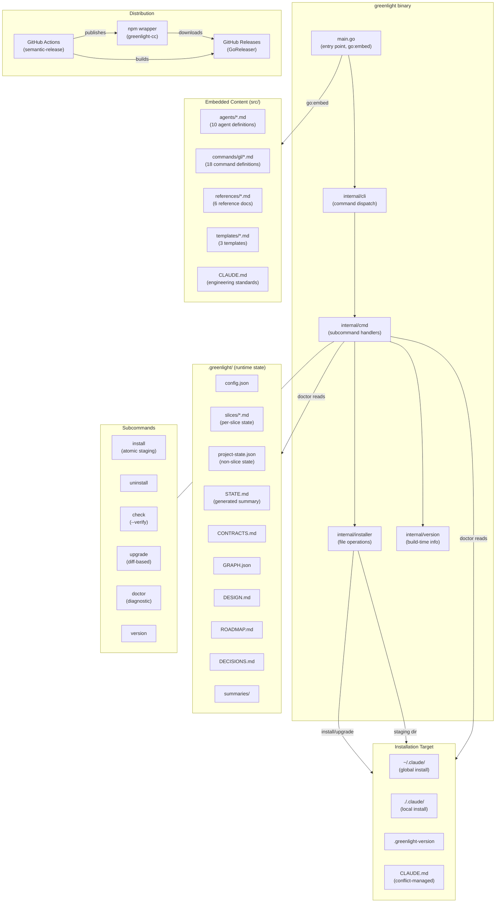

# Product Roadmap

Project: greenlight
Updated: 2026-02-22

## Architecture

## Milestone: cli-stabilisation [complete]

**Goal:** Establish the Go CLI with full test coverage, replacing the untested codebase with a verified, contract-driven implementation.

| Slice | Description | Status | Tests | Completed | Key Decision |
|-------|-------------|--------|-------|-----------|--------------|
| S-01 | Version command prints build info | complete | 7 | 2026-02-08 | Build-time ldflags injection |
| S-02 | Flag parsing for scope and conflict | complete | 33 | 2026-02-08 | Manual parsing over flag package |
| S-03 | CLAUDE.md conflict strategies | complete | 31 | 2026-02-08 | keep/replace/append strategies |
| S-04 | Install copies manifest to target | complete | 55 | 2026-02-08 | Manifest-driven, not FS walk |
| S-05 | Check verifies installation integrity | complete | 52 | 2026-02-08 | SHA-256 verify mode (--verify) |
| S-06 | Uninstall removes managed files | complete | 28 | 2026-02-08 | Preserve CLAUDE.md, remove artifacts |
| S-07 | CLI dispatches to subcommands | complete | 22 | 2026-02-08 | cli.Run accepts io.Writer |

**Summary:** 7 slices, 228 tests. CLI install/uninstall/check/version fully tested.

## Milestone: brownfield-and-docs [complete]

**Goal:** Add brownfield codebase support (assess, wrap) and human-facing documentation system (roadmap, changelog, auto-summaries, decision log).

| Slice | Description | Status | Tests | Completed | Key Decision |
|-------|-------------|--------|-------|-----------|--------------|
| S-12 | Infrastructure and config templates | complete | 8 | 2026-02-09 | config.json profiles for agent models |
| S-08 | Codebase assessment agent and command | complete | 0 | 2026-02-09 | Priority-tiered output (Critical/High/Medium) |
| S-09 | Boundary wrapping agent and command | complete | 0 | 2026-02-09 | [WRAPPED] tag in CONTRACTS.md |
| S-10 | Brownfield-aware command updates | complete | 0 | 2026-02-09 | Wrapper isolation exception for locking tests |
| S-11 | Locking-to-integration transition | complete | 0 | 2026-02-09 | Locking tests deleted after refactor |
| S-13 | Documentation infrastructure | complete | 24 | 2026-02-09 | Manifest +6 entries for new commands/agents |
| S-14 | Auto-summaries and decision aggregation | complete | 38 | 2026-02-09 | Task-based summary generation, not separate agent |
| S-15 | Roadmap command | complete | 29 | 2026-02-09 | Milestone-scoped design sessions via gl-designer |
| S-16 | Changelog command | complete | 30 | 2026-02-09 | Read-only, formats from summaries/ |
| S-17 | Brownfield-roadmap integration | complete | 20 | 2026-02-09 | STATE.md (machine) + ROADMAP.md (human) coexist |

**Summary:** 10 slices, 187 additional tests (415 total). Full brownfield support and documentation system.

## Milestone: circuit-breaker [complete]

**Goal:** Prevent implementer death spirals with automatic attempt tracking, structured diagnostics, scope lock, manual override (/gl-debug), and rollback via git tags. When the implementer gets stuck, it stops early, reports clearly, and the user can recover in minutes instead of losing hours.

| Slice | Description | Status | Tests | Completed | Key Decision |
|-------|-------------|--------|-------|-----------|--------------|
| S-18 | Circuit breaker protocol and implementer integration | complete | 14 | 2026-02-18 | Per-test (3) + slice ceiling (7), structured diagnostic fields |
| S-19 | Checkpoint/rollback and scope lock | complete | 12 | 2026-02-18 | Lightweight git tags, inferred scope from contracts |
| S-20 | /gl-debug command and CLAUDE.md rule | complete | 8 | 2026-02-18 | Standalone diagnostic, 5-line hard rule in CLAUDE.md |
| S-21 | Manifest integration and end-to-end verification | complete | 7 | 2026-02-18 | +2 manifest entries, full flow verified |

**Summary:** 4 slices, 41 additional tests (456 total). Circuit breaker stops death spirals with structured diagnostics, scope lock, rollback, and manual override.

## Milestone: verification-tiers [complete]

**Goal:** Close the gap between "tests pass" and "user got what they asked for." Add per-contract verification tiers (auto/verify), human acceptance gates after verification, rejection-to-TDD routing, and escalation. When tests pass but output doesn't match intent, the user catches it before the slice is marked complete.

| Slice | Description | Status | Tests | Completed | Key Decision |
|-------|-------------|--------|-------|-----------|--------------|
| S-22 | Schema extension: contract verification fields | complete | 24 | 2026-02-19 | verification/acceptance_criteria/steps in contracts, default verify |
| S-23 | Verification gate: Step 6b in /gl:slice | complete | 37 | 2026-02-19 | verify > auto resolution, one checkpoint per slice |
| S-24 | Rejection flow: classification and TDD routing | complete | 48 | 2026-02-19 | Gap classification UX with test_gap/contract_gap/implementation_gap routing |
| S-25 | Rejection counter: escalation at 3 | complete | 53 | 2026-02-19 | YAML state tracking, ESCALATION header with re-scope/pair/skip routing |
| S-26 | Documentation: CLAUDE.md, checkpoint, deprecation | complete | 31 | 2026-02-19 | CLAUDE.md 5-line rule, Acceptance checkpoint type, manifest 34→35 |
| S-27 | Architect integration: tier generation guidance | complete | 60 | 2026-02-19 | Verification Tier Selection section + 4 output checklist items |

**Summary:** 6 slices, 253 additional tests (710 total). Verification tiers close the gap between "tests pass" and "user got what they asked for."

## Milestone: parallel-state [complete]

**Goal:** Fix concurrent session state corruption by replacing the single STATE.md with per-slice state files. Each session writes only to its own slice's file, eliminating write conflicts by design. STATE.md becomes a generated summary view. Backward compatible with existing projects.

| Slice | Description | Status | Tests | Completed | Key Decision |
|-------|-------------|--------|-------|-----------|--------------|
| S-28 | Slice state template and reference docs | complete | 93 | 2026-02-22 | Flat key-value frontmatter, state-format.md detection logic |
| S-29 | Init command and state detection | complete | 43 | 2026-02-22 | Directory existence check, slices/ dir + project-state.json |
| S-30 | Slice command state write | complete | 42 | 2026-02-22 | Immediate session claim, own-file writes only, STATE.md regen |
| S-31 | Supporting command updates | complete | 74 | 2026-02-22 | All 6 commands gain state detection, format-aware read/write paths |
| S-32 | Migration command (/gl:migrate-state) | complete | 55 | 2026-02-22 | One-way explicit migration, all-or-nothing atomicity, backup preserved |
| S-33 | Documentation and CLAUDE.md | complete | 22 | 2026-02-22 | State format awareness hard rule, both formats documented |
| S-34 | Manifest integration and verification | complete | 11 | 2026-02-22 | +3 manifest entries (35→38), all buildTestFS helpers updated |

## Milestone: cli-orchestrator [active]

**Goal:** Extend the Go CLI binary into a full `gl` orchestrator that runs `/gl:slice` sessions autonomously, executes multiple slices in parallel via tmux, provides local commands (`gl status`, `gl roadmap`, `gl changelog`) that work without Claude, and handles interactive commands (`gl init`, `gl design`) that need user input.

| Slice | Description | Status | Tests | Completed | Key Decision |
|-------|-------------|--------|-------|-----------|--------------|
| S-35 | Frontmatter parser (internal/frontmatter) | complete | 22 | 2026-02-23 | Flat key-value line parser, stdlib only |
| S-36 | State reader (internal/state) | complete | 41 | 2026-02-23 | os.ReadDir + frontmatter.Parse, json.RawMessage for field detection |
| S-37 | CLI dispatch extension | complete | 12 | 2026-02-23 | Stub handlers, categorized usage, no contentFS for new commands |
| S-38 | gl status command | complete | 24 | 2026-02-23 | 20-char ASCII bar, graceful GRAPH.json degradation, --compact for tmux |
| S-39 | Help Command | complete | 13 | 2026-02-23 | Best-effort state summary, directory detection |
| S-40 | Roadmap and Changelog Commands | complete | 25 | 2026-02-23 | Verbatim roadmap, sorted changelog with --- separators |
| S-41 | Process Spawner | complete | 15 | 2026-02-23 | LookPath DI for testability, --dangerously-skip-permissions stripping |
| S-43 | tmux Manager (internal/tmux) | complete | 18 | 2026-02-23 | LookPath DI, Build* pattern, no shell concatenation |
| S-42 | Single Slice Command | complete | 36 | 2026-02-26 | Config-driven flags, wave/ID auto-detect, context-aware dispatch |
| S-44 | Parallel Slice Execution | complete | 38 | 2026-02-26 | Default max 4, tmux session naming, sequential fallback |
| S-46 | Interactive Commands | complete | 46 | 2026-02-26 | Context-aware dispatch, .greenlight/ check for design only |
| S-45 | Watch Mode | complete | 50 | 2026-02-26 | Configurable interval, enhanced dry-run categories, immediate termination |
| - | Signal handling and integration | pending | - | - | SIGINT/SIGTERM graceful shutdown |

**Note:** Slice IDs and exact boundaries will be assigned by the architect during contract generation. The rows above represent logical groupings from the design, not final slices.

## Milestone: cli-hardening [planning]

**Goal:** Harden the Go CLI with proper error handling, input validation, atomic install, named constants, and new upgrade and doctor commands.

| Slice | Description | Status | Tests | Completed | Key Decision |
|-------|-------------|--------|-------|-----------|--------------|
| - | Named constants and build hygiene | pending | - | - | Single constants.go, go.sum, remove binary |
| - | Error handling hardening | pending | - | - | stderr in main.go, uninstall warnings |
| - | Input validation and flag parsing | pending | - | - | Path traversal prevention, strings.HasPrefix |
| - | Atomic install with staging | pending | - | - | Same-filesystem staging dir with PID |
| - | Version file extended format | pending | - | - | 4th line for conflict strategy, lenient parsing |
| - | Upgrade command | pending | - | - | Auto-detect, diff-based, SHA-256 comparison |
| - | Doctor command | pending | - | - | Report-only, exit 1 on issues, structured output |
| - | CLI dispatch and help updates | pending | - | - | Add upgrade and doctor to dispatch |

**Note:** Slice IDs and exact boundaries will be assigned by the architect during contract generation. The rows above represent logical groupings from the design, not final slices.

## Future Milestones

| Milestone | Goal | Status |
|-----------|------|--------|
| distribution | Homebrew tap, curl install script, improved npm wrapper | not planned |
| plugin-system | Extensible agent and command definitions | not planned |
| multi-runtime | Support for OpenCode, Gemini, and other AI coding assistants | not planned |
