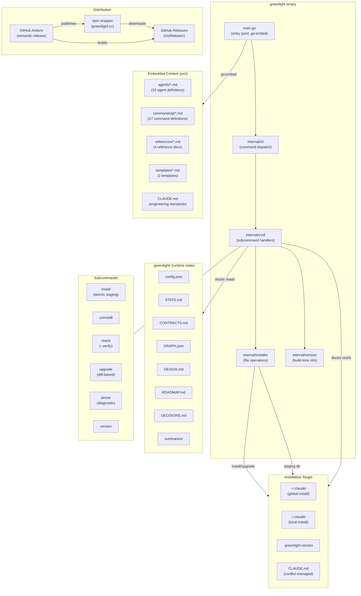

# Product Roadmap

Project: greenlight
Updated: 2026-02-18

## Architecture

## Milestone: cli-stabilisation [complete]

**Goal:** Establish the Go CLI with full test coverage, replacing the untested codebase with a verified, contract-driven implementation.

| Slice | Description | Status | Tests | Completed | Key Decision |
|-------|-------------|--------|-------|-----------|--------------|
| S-01 | Version command prints build info | complete | 7 | 2026-02-08 | Build-time ldflags injection |
| S-02 | Flag parsing for scope and conflict | complete | 33 | 2026-02-08 | Manual parsing over flag package |
| S-03 | CLAUDE.md conflict strategies | complete | 31 | 2026-02-08 | keep/replace/append strategies |
| S-04 | Install copies manifest to target | complete | 55 | 2026-02-08 | Manifest-driven, not FS walk |
| S-05 | Check verifies installation integrity | complete | 52 | 2026-02-08 | SHA-256 verify mode (--verify) |
| S-06 | Uninstall removes managed files | complete | 28 | 2026-02-08 | Preserve CLAUDE.md, remove artifacts |
| S-07 | CLI dispatches to subcommands | complete | 22 | 2026-02-08 | cli.Run accepts io.Writer |

**Summary:** 7 slices, 228 tests. CLI install/uninstall/check/version fully tested.

## Milestone: brownfield-and-docs [complete]

**Goal:** Add brownfield codebase support (assess, wrap) and human-facing documentation system (roadmap, changelog, auto-summaries, decision log).

| Slice | Description | Status | Tests | Completed | Key Decision |
|-------|-------------|--------|-------|-----------|--------------|
| S-12 | Infrastructure and config templates | complete | 8 | 2026-02-09 | config.json profiles for agent models |
| S-08 | Codebase assessment agent and command | complete | 0 | 2026-02-09 | Priority-tiered output (Critical/High/Medium) |
| S-09 | Boundary wrapping agent and command | complete | 0 | 2026-02-09 | [WRAPPED] tag in CONTRACTS.md |
| S-10 | Brownfield-aware command updates | complete | 0 | 2026-02-09 | Wrapper isolation exception for locking tests |
| S-11 | Locking-to-integration transition | complete | 0 | 2026-02-09 | Locking tests deleted after refactor |
| S-13 | Documentation infrastructure | complete | 24 | 2026-02-09 | Manifest +6 entries for new commands/agents |
| S-14 | Auto-summaries and decision aggregation | complete | 38 | 2026-02-09 | Task-based summary generation, not separate agent |
| S-15 | Roadmap command | complete | 29 | 2026-02-09 | Milestone-scoped design sessions via gl-designer |
| S-16 | Changelog command | complete | 30 | 2026-02-09 | Read-only, formats from summaries/ |
| S-17 | Brownfield-roadmap integration | complete | 20 | 2026-02-09 | STATE.md (machine) + ROADMAP.md (human) coexist |

**Summary:** 10 slices, 187 additional tests (415 total). Full brownfield support and documentation system.

## Milestone: circuit-breaker [planning]

**Goal:** Prevent implementer death spirals with automatic attempt tracking, structured diagnostics, scope lock, manual override (/gl-debug), and rollback via git tags. When the implementer gets stuck, it stops early, reports clearly, and the user can recover in minutes instead of losing hours.

| Slice | Description | Status | Tests | Completed | Key Decision |
|-------|-------------|--------|-------|-----------|--------------|
| - | Attempt tracker + diagnostic report | pending | - | - | Per-test (3) + slice ceiling (7), structured markdown fields |
| - | Scope lock | pending | - | - | Inferred from contracts, optional GRAPH.json override |
| - | Rollback integration | pending | - | - | Lightweight git tags, cleanup at slice completion |
| - | /gl-debug command | pending | - | - | Standalone diagnostic, structured for future pause/resume |
| - | CLAUDE.md + manifest integration | pending | - | - | 5-line hard rule + references/circuit-breaker.md |
| - | End-to-end verification | pending | - | - | Full flow: track, trip, diagnose, rollback, retry, pass |

**Note:** Slice IDs and exact boundaries will be assigned by the architect during contract generation. The rows above represent logical groupings from the design, not final slices.

## Milestone: cli-hardening [planning]

**Goal:** Harden the Go CLI with proper error handling, input validation, atomic install, named constants, and new upgrade and doctor commands.

| Slice | Description | Status | Tests | Completed | Key Decision |
|-------|-------------|--------|-------|-----------|--------------|
| - | Named constants and build hygiene | pending | - | - | Single constants.go, go.sum, remove binary |
| - | Error handling hardening | pending | - | - | stderr in main.go, uninstall warnings |
| - | Input validation and flag parsing | pending | - | - | Path traversal prevention, strings.HasPrefix |
| - | Atomic install with staging | pending | - | - | Same-filesystem staging dir with PID |
| - | Version file extended format | pending | - | - | 4th line for conflict strategy, lenient parsing |
| - | Upgrade command | pending | - | - | Auto-detect, diff-based, SHA-256 comparison |
| - | Doctor command | pending | - | - | Report-only, exit 1 on issues, structured output |
| - | CLI dispatch and help updates | pending | - | - | Add upgrade and doctor to dispatch |

**Note:** Slice IDs and exact boundaries will be assigned by the architect during contract generation. The rows above represent logical groupings from the design, not final slices.

## Future Milestones

| Milestone | Goal | Status |
|-----------|------|--------|
| distribution | Homebrew tap, curl install script, improved npm wrapper | not planned |
| plugin-system | Extensible agent and command definitions | not planned |
| multi-runtime | Support for OpenCode, Gemini, and other AI coding assistants | not planned |
